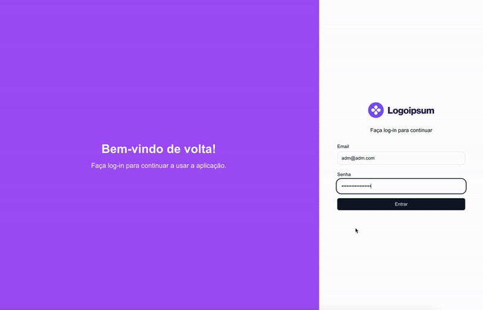

# 👨‍💻 CRUD de Usuários (Web)




> CRUD simples de usuários, porém com um alto teor de tecnologia. Empregando conhecimentos sobre Next.JS, JWT, Casl (permissões), Docker e outros.

## 💻 Pré-requisitos

Antes de começar, verifique se você atende aos seguintes requisitos:

- ⚠️ Inicialize PRIMEIRO o projeto da API (repositório [aqui](https://github.com/Seiixas/api-users)).
- 🐋 Docker
- 🚪 Portas: 3000 (api), 3001 (web), 5450 (postgres),9000 e 9001 (minio), 1025 e 8025 (mailhog) disponíveis.

## 🚀 Instalando

### 🧰 Variáveis de ambiente

O formato das variáveis de ambiente encontra-se no arquivo `.env.copy`.

| Variável            | Definição   |
| ------------------- | ----------- |
| NEXT_PUBLIC_API_URL | URL da API. |

Simples, não? Mas, de qualquer forma, deixarei aqui embaixo a env que estou utilizando onde não há dados sensíveis:

```
NEXT_PUBLIC_API_URL=http://localhost:3000
```

### 🐳 Docker

Para começar é necessário inicializar todas as instâncias Docker da aplicação, para isso existe um atalho no `package.json`, então basta executar:

```
npm run docker:build
```

Ao executer este comando, apenas o container do front-end será inicializado.

⚠️ **Importante**: Os containers docker do projeto da API devem rodar primeiro, pois é nele onde a rede docker é criada para comunicação entre os containers, além do óbvio: O front-end depende do back-end 😁.
